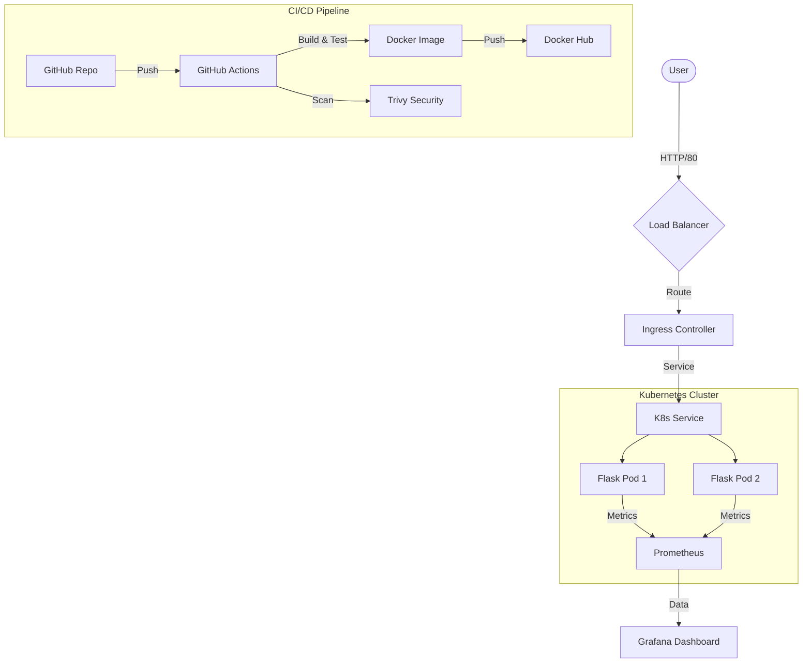

# DevOps Portfolio Project 🚀

A comprehensive demonstration of modern DevOps practices, tools, and methodologies. This repository contains a full-stack implementation of a containerized application with Infrastructure as Code, CI/CD, Orchestration, and Observability.

## 🛠️ Tech Stack

| Domain | Tool | Description |
| :--- | :--- | :--- |
| **Application** | Python / Flask | RESTful Microservice |
| **Containerization** | Docker | Multi-stage Dockerfile optimized for size |
| **Orchestration** | Kubernetes | Deployment, Service, and Ingress manifests |
| **IaC** | Terraform | Infrastructure provisioning (Docker provider) |
| **CI/CD** | GitHub Actions | Automated Linting, Testing, and Building |
| **Monitoring** | Prometheus | Metric Scraping and Aggregation |
| **Visualization** | Grafana | Dashboards for application metrics |
| **Logging** | Loki | Centralized logging and aggregation |
| **Packaging** | Helm | Helm Chart for scalable deployment |

## 🏗️ Architecture



## 📂 Project Structure

```bash
├── .github/workflows   # CI/CD Pipeline (GitHub Actions)
├── app/                # Flask Application & Dockerfile
├── helm/               # Helm Chart for Kubernetes
├── k8s/                # Kubernetes Manifests (YAML)
├── monitoring/         # Prometheus Config
├── terraform/          # Terraform Infrastructure Code
└── docker-compose.yml  # Local Development Environment
```

## 🚀 Getting Started

### Prerequisites
- Docker & Docker Compose
- Git

### Quick Start (Local)

1.  **Clone the repository**
    ```bash
    git clone https://github.com/dawiay/DevOps-Portfolio-latest.git
    cd DevOps-Portfolio-latest
    ```

2.  **Run the Stack**
    ```bash
    docker-compose up -d --build
    ```

3.  **Access Services**
    - **Web App**: [http://localhost:5000](http://localhost:5000)
    - **Prometheus**: [http://localhost:9090](http://localhost:9090)
    - **Loki**: [http://localhost:3100](http://localhost:3100)
    - **Grafana**: [http://localhost:3000](http://localhost:3000) (Login: `admin` / `admin`)

## 📊 Features

### 1. CI/CD Pipeline
Every push to `main` triggers a GitHub Actions workflow that:
- Lints the Python code with `flake8`.
- Builds the Docker image to ensure reproducibility.

### 2. Infrastructure as Code (Terraform)
The `terraform/` directory is refactored into **Modules** to support multi-environment deployments:
- `modules/docker_stack`: Reusable code for the container stack.
- `environments/dev`: Development configuration.
- `environments/prod`: Production-ready configuration.

### 3. Secrets Management (Phase 4)
Demonstrates senior-level security patterns including:
- **SOPS** encryption patterns.
- **External Secrets Operator** (Kubernetes) integration guide.
- GitHub Actions secret injection.

### 3. Observability
The application is instrumented with `prometheus_flask_exporter`. Real-time metrics are scraped by Prometheus and visualized in Grafana.

### 4. Kubernetes & Helm
Standard Kubernetes manifests are provided in `k8s/`, and a production-ready Helm chart is available in `helm/devops-portfolio`.

### 5. Centralized Logging (Phase 4)
Integrated **Grafana Loki** and **Promtail** to aggregate logs from all containers. Logs can be queried directly in Grafana using LogQL.
